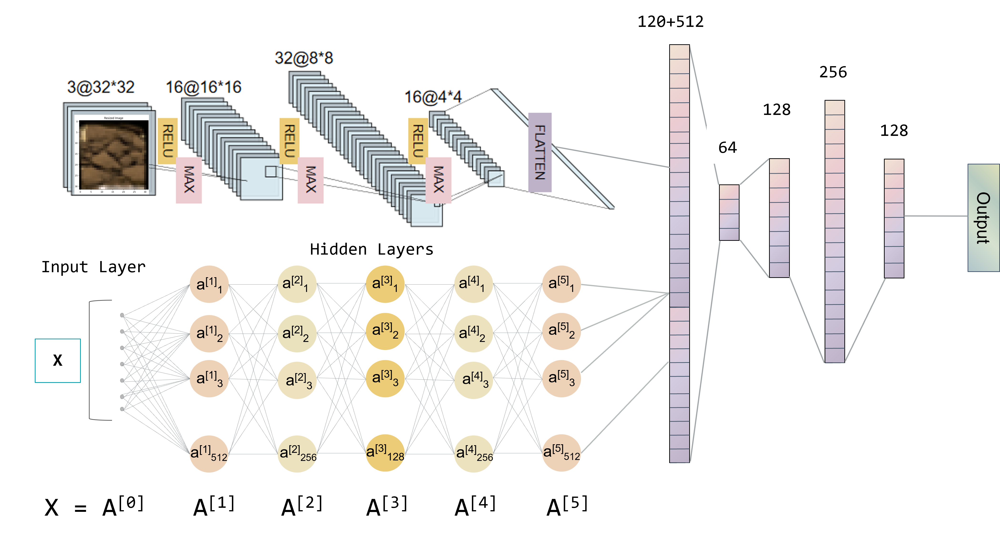
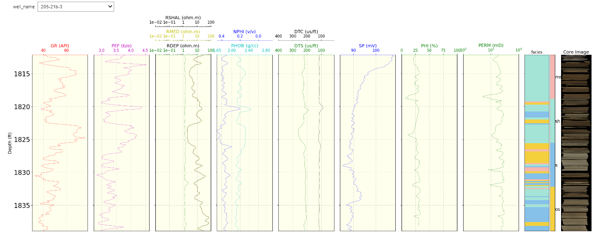

# Geo-Interpreter
## Machine Learning Repository for Permeability and Lithofacies Prediction


Welcome! this repository merges geoscience with machine learning, focusing on permeability and lithofacies prediction. It serves pre-trained model that can predict both properties with well-logging and core image data. It  is encapsulated in an user-friendly class called `Interpreter`. 

## Software Installation Guide

1. Download the Geo-Intepreter package from the ads-arcadia-reservoirrocks repository on github
2. Create the environment by navigating into the folder with the file `environment.yml` and running the command

```bash
conda env create -f environment.yml
```
3. Activate the environment with

```
bash
conda activate geointerpreter
```
4. If you are already inside an environment, and would like to install it as a stand-alone `python` package, run the command
```bash
pip install .
```
---
## User Instructions
- To check-out the features of Geo-Interpreter package, open notebook `demonstration.ipynb`located at the project's root folder
- Before running the `demonstration.ipynb`, a folder called `data/` that will contain the input data for prediction should be created under `geointerpreter` module. The structure of the folder should follow:
```
.
data/
├── {well_name}_depth.npy
├── {well_name}_image.npy
├── {well_name}_logs.las
└── {well_name}.csv
```
- Class descriptions:
1. **Import the Interpreter class**: To import the Interpreter class, which is the main class that contains all of the functionalities to preprocess the data and do the predictions, run
```python
from geointerpreter import Interpreter
```

2. **Instantiate Interpreter object**: To instantiate the Interpreter object, run 
```python
interpreter = Interpreter()
```
This will automatically load and prepare (with the help of preprocessing functions to merge tables and combine same-meaning-columns in the `utility.py`) the dataset for prediction, saved in an attribute of the object `interpreter.df` as a *DataFrame*

3. **Predict facies, permeability, and update the *DataFrame***: To do the workflow, run
```python
interpreter.update_df()
```
This will check if the *DataFrame* already has `facies` or `permeability` column. If not, it will trigger the respective `predict_facies` or `predict_permeability`. When run, the model will be loaded to the interpeter's `models` attribute as a dictionary element with the help of `ModelLoader` class from `loaders.py`. Should you want to select specific model to load, you can provide the argument to the update_df() function
```python
interpreter.update_df(permeability_method="RandomForest", facies_method="ConcatCNN")

# Available methods
facies_classes_methods = {
    "RandomClass": "Facies Classification - Random Class Assignment",
    "ConcatCNN": "Facies Classification - ConcatCNN Model"
}

permeability_methods = {
    "RandomValue": "Permeability Prediction - Random Value Assignment",
    "RandomForest": "Permeability Prediction - Random Fores Model",
    "SVR": "Permeability Prediction - Support Vector Regression Model",
    "XGB": "Permeability Prediction - XGBoost Model"
}
```
The most interesting part of the provided model is the `ConcatCNN` architecture. It combines the core image information, feed it into convolutional neural-network, and when it is flatten, it will be concatenated with layers of feed forward-network that comes from well-log data. 


4. **Display and save the *DataFrame***: To display the *DataFrame* at any point in time, run
```python
interpreter.df
```
And to save the *DataFrame* to .csv, user can simply run
```python
interpreter.save_df()
```
and it will automatically be saved to the current directory as a csv. User can also provide a save path to the function.

5. **Visualizing the prediction**: The visualization provide powerful log plot to visualize important logs, corresponding core images, along with permeability and facies prediction. to display the log plot, run
```python
interpreter.plot_result()
```
this will bring up the well-log curves plot, core image, along with permeability and facies prediction. The plot itself is packaged in a function inside `visualization.py`. It also has a dropdown capability to accommodate multi-well prediction analysis.


## Re-train the model
To re-train the model with the data and see how the data preprocessing, splitting, and pipeline is done, check-out `facies_train_clean.ipynb` and `permeability_train_clean.ipynb` located in the `notebooks` folder.
You can utilize the data (combination of raw and processed-ones) downloaded from these links:
1. Facies Model Training Data: https://imperiallondon-my.sharepoint.com/:f:/g/personal/km1123_ic_ac_uk/Eotds4s_huBJk2XOy2uDPV4BF2tY6Epa92yvE9d00e9oFQ?e=B60GLJ
2. Permeability Model Training Data: https://imperiallondon-my.sharepoint.com/:f:/g/personal/hf923_ic_ac_uk/Em9Q73b8E0tOmqMZwAOa0PgBFbaiPaxOVHa9WX29VjoKlg?e=Sqr4co 

## Testing the Code
To test the code, run `pytest` at the project's root folder to test the utility and interpreter functions

## Contributors
1. Hadrian Fung
2. Aulia Ahmad Naufal
3. Rami Khouli
4. Kanin Matangkapong
5. Gong Luyi
6. Junyu Li
7. Jianze Lu
8. Nhoyidi Nsan
9. Wang Zekai
